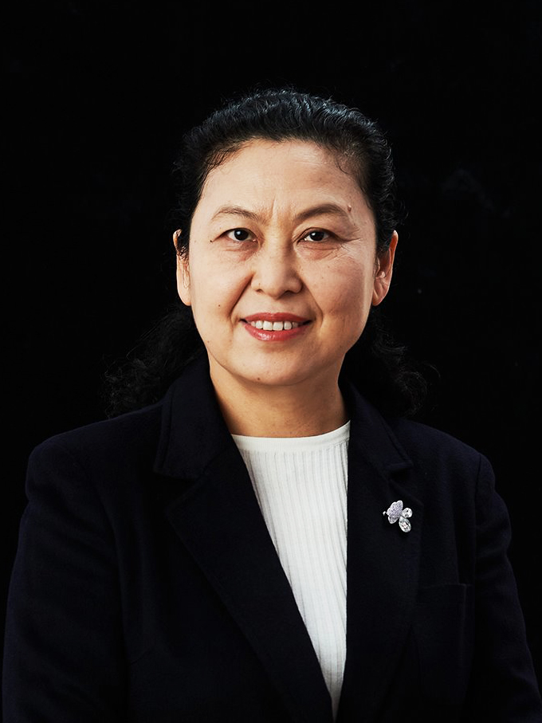
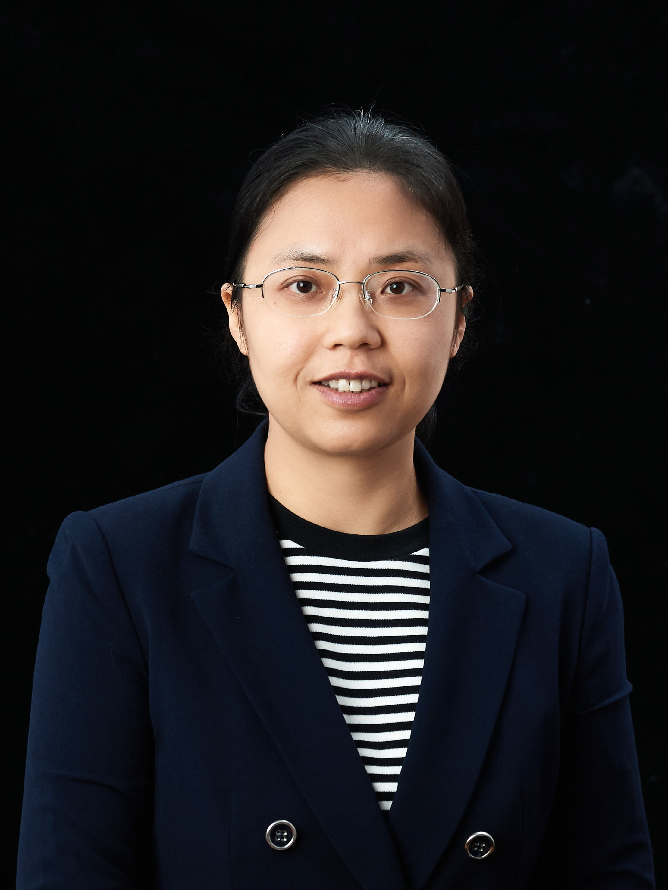
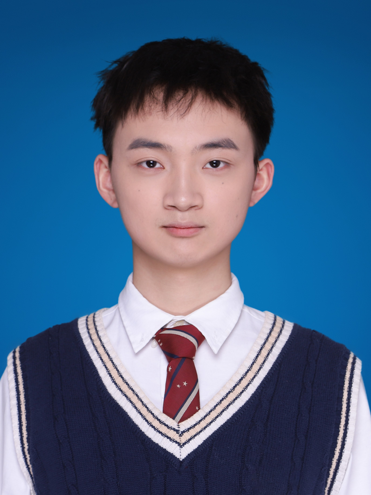
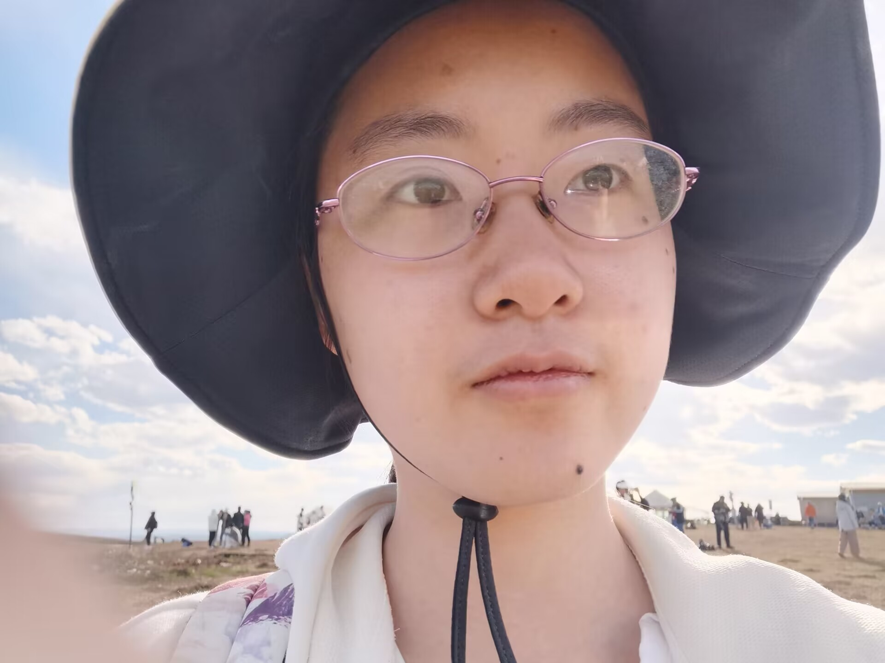
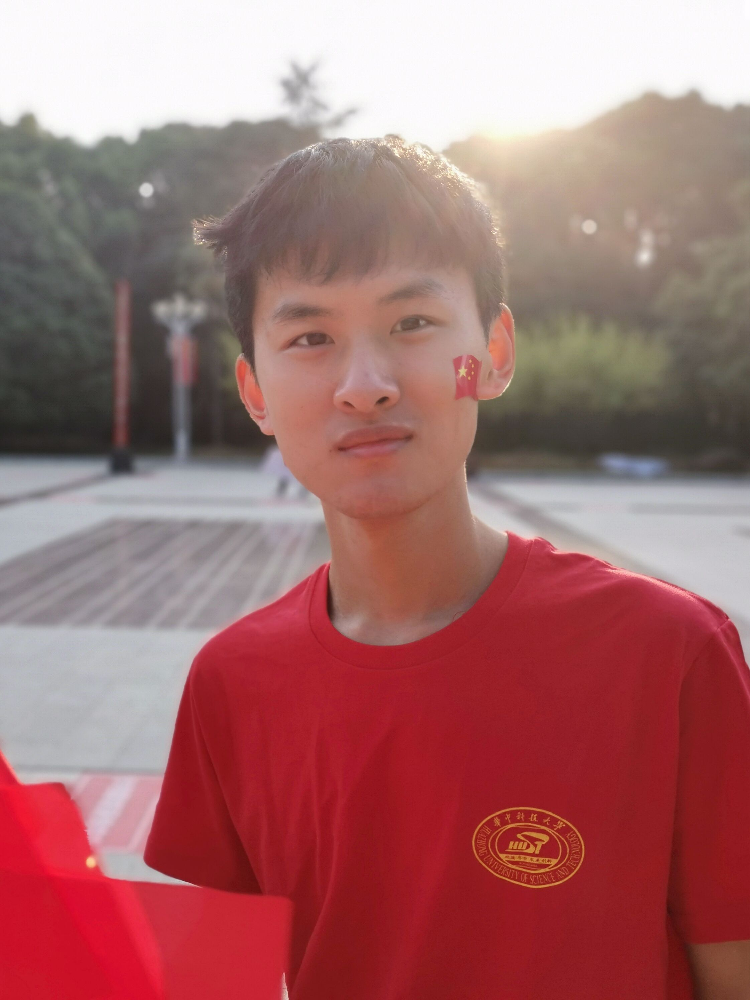
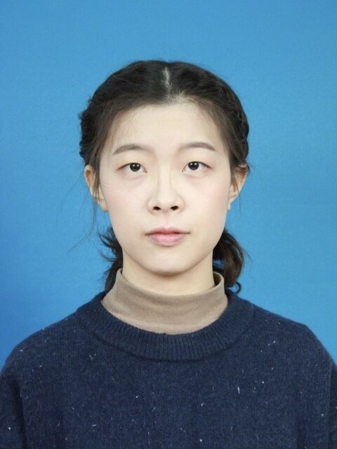
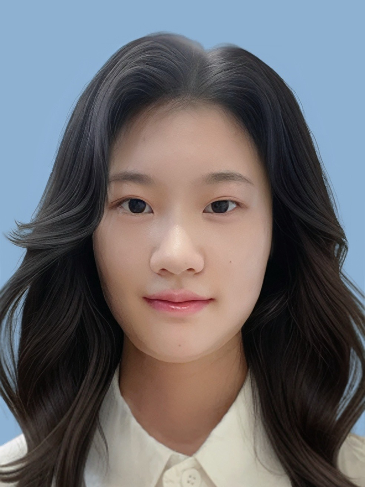

## Teachers

<table class="memberTable" border="0" width="100%" align="center">
        <tbody>
            <tr>
                <td>
                    

                </td>
                <td>
                    

                </td>
            </tr>
            <tr>
                <td>
                    

                        <a href="http://faculty.hust.edu.cn/dfeng/en/index.htm">Dan Feng </a>
                        <a href="https://scholar.google.com/citations?user=9dNaB5AAAAAJ&hl=zh-CN">[Google Scholar]</a>
                    

                </td>
                <td>
                    

                        <a href="http://faculty.hust.edu.cn/tongwei/zh_CN/index.htm">Wei Tong </a>
                        <a href="https://scholar.google.com/citations?user=fq-Go0sAAAAJ&hl=zh-CN">[Google Scholar]</a>
                    

                </td>
            </tr>
        </tbody>
</table>

## Postdocs

<table class="memberTable" border="0" width="100%" align="center">
    <tbody>
        <tr>
            <td>
                

            </td>
            <!-- <td>
                

            </td> -->
            <td>
                

            </td>
        </tr>
        <tr>
            <td>
                

                    <a href="https://ieeexplore.ieee.org/author/37086029868">Bing Wu</a>
                

            </td>
            <!-- <td>
                

                    <a href="https://ieeexplore.ieee.org/author/37086250505">Chengning Wang</a>
                

            </td> -->
            <td>
                

                    <a href="https://ieeexplore.ieee.org/author/37086938196">Xueliang Wei</a>
                

            </td>
        </tr>
    </tbody>
</table>

## PhD Students

### In Lab

<table class="memberTable" border="0" width="100%" align="center">
        <tbody>
            <!-- 第一行开始 -->
            <tr>
                <td>
                    

                </td>
                <td>
                    

                </td>
                <td>
                    

                </td>
            </tr>
            <tr>
                <td>
                    

                        
Tianqi Zhan

                    

                </td>
                <td>
                    

                        
Heng Zhou

                    

                </td>
                <td>
                    

                        
Huan Cheng

                    

                </td>
            </tr>
            <!-- 第二行结束
            第三行开始 -->
            <tr>
                <td>
                    

                </td>
                <td>
                    

                </td>
                <td>
                    

                </td>
            </tr>
            <tr>
                <td>
                    

                        
Weilin Zhu

                    

                </td>
                <td>
                    

                        
Jinpeng Liu

                    

                </td>
                <td>
                    

                        
Dong Huang

                    

                </td>
            </tr>
            <!-- 第三行结束
            第四行开始 -->
            <tr>
                <td>
                    

                </td>
                <td>
                    

                </td>
                <td>
                    

                </td>
            </tr>
            <tr>
                <td>
                    

                        <a href="https://github.com/NickLee2050">Shuhan Li</a>
                    

                </td>
                <td>
                    

                        
Yibo Liu

                    

                </td>
                <td>
                    

                        <a href="https://gitee.com/twelvecat">Xu Jiang</a>
                    

                </td>
            </tr>
            <!-- 第四行结束
            第五行开始 -->
            <tr>
                <td>
                    

                </td>
                <td>
                    

                </td>
                <td>
                    

                </td>
            </tr>
            <tr>
                <td>
                    

                        <a href="https://github.com/Bodensteins">Taoming Lei</a>
                    

                </td>
                <td>
                    

                        
Zezheng Li

                    

                </td>
                <td>
                    

                        
Yao Deng

                    

                </td>
            </tr>
            <!-- 第五行结束
            第六行开始 -->
            <tr>
                <td>
                    

                </td>
                <td>
                    

                </td>
                <td>
                    

                </td>
            </tr>
            <tr>
                <td>
                    

                        <a href="https://yufeiwang0821.github.io">Yufei Wang</a>
                    

                </td>
                <td>
                    

                        <a href="https://github.com/quyifei23">Yifei Qu</a>
                    

                </td>
                <td>
                    

                        
Chuan Chen

                    

                </td>
            </tr>
            <!-- 第六行结束
            第七行开始 -->
            <tr>
                <td>
                    

                </td>
                <td>
                    

                </td>
            </tr>
            <tr>
                <td>
                    

                        
Yuhuan Jiang

                    

                </td>
                <td>
                    

                        
Shiyi Song

                    

                </td>
            </tr>
        </tbody>
</table>

### Graduated

2025:

> Bo Ding(Huawei)

2023:

> Wei Zhao (Alibaba)

2022:

> Jinyu Yu, Bing Wu (HUST), Xueliang Wei (HUST)

2021:

> Chengning Wang (HUST), Hongwei Qin (Huawei)

2020:

> Jie Xu (Huawei)

2019:

> Yang Zhang (Huawei) , Yazhi Feng (Huawei)

2018:

> Zheng Li (Huawei) , Jianquan Zhang (Hubei University of Science and Technology)

## Master Students

### In Lab

<table class="memberTable" border="0" width="100%">
        <tbody>
            <!-- 第一行开始 -->
            <tr>
                <td>
                    

                </td>
                <td>
                    

                </td>
                <td>
                    

                </td>
            </tr>
            <tr>
                <td>
                    

                        <a href="https://jihulab.com/DYQ">Yuqi Dong</a>
                    

                </td>
                <td>
                    

                        
Zhiyang Hu

                    

                </td>
                <td>
                    

                        <a href="https://github.com/RatRat0">Lin Li</a>
                    

                </td>
            </tr>
            <!-- 第一行结束
            第二行开始 -->
            <tr>
                <td>
                    

                </td>
                <td>
                    

                </td>
                <td>
                    

                </td>
            </tr>
            <tr>
                <td>
                    

                        <a href="https://gitlab.com/raglarose">Hongye Lu</a>
                    

                </td>
                <td>
                    

                        
Hongtao Zhang

                    

                </td>
                <td>
                    

                        
Yige Zou

                    

                </td>
            </tr>
            <!-- 第二行结束
            第三行开始 -->
            <tr>
                <td>
                    

                </td>
                <td>
                    

                </td>
                <td>
                    

                </td>
            </tr>
            <tr>
                <td>
                    

                        
Zetao Cui

                    

                </td>
                <td>
                    

                        <a href="https://github.com/8u9mak3r">Haoming Da</a>
                    

                </td>
                <td>
                    

                        <a href="https://github.com/antsuge">Yuli Dong</a>
                    

                </td>
            </tr>
            <!-- 第三行结束
            第四行开始 -->
            <tr>
                <td>
                    

                </td>
                <td>
                    

                </td>
                <td>
                    

                </td>
            </tr>
            <tr>
                <td>
                    

                        
Keyu Huang

                    

                </td>
                <td>
                    

                        <a href="https://github.com/123456789a12">Shengyu Jin</a>
                    

                </td>
                <td>
                    

                        <a href="https://github.com/Weipp7">Panyue Wei</a>
                    

                </td>
            </tr>
            <!-- 第四行结束
            第五行开始 -->
            <tr>
                <td>
                    

                </td>
                <td>
                    

                </td>
                <td>
                    

                </td>
            </tr>
            <tr>
                <td>
                    

                        <a href="https://github.com/spacemaninhust">Yuhang Zhao</a>
                    

                </td>
                <td>
                    

                        
Chengshang Cui

                    

                </td>
                <td>
                    

                        
Mingzhe Dong

                    

                </td>
            </tr>
            <!-- 第五行结束
            第六行开始 -->
            <tr>
                <td>
                    

                </td>
                <td>
                    

                </td>
                <td>
                    

                </td>
            </tr>
            <tr>
                <td>
                    

                        
Xiaoyang Hu

                    

                </td>
                <td>
                    

                        
Enbao Pan

                    

                </td>
                <td>
                    

                        
Yujun Xu

                    

                </td>
            </tr>
            <!-- 第六行结束
            第七行开始 -->
            <tr>
                <td>
                    

                </td>
                <td>
                    

                </td>
            </tr>
            <tr>
                <td>
                    

                        
Nabaichuan Zhang

                    

                </td>
                <td>
                    

                        
Yu Zhong

                    

                </td>
            </tr>
            <!-- 第七行结束 -->
        </tbody>
</table>

### Graduated

2025：
> Hongjie Luo(Huawei), Zhongyu Qin(T-Head Semiconductor), Run Wan(Tencent), Yuan Xia(Alibaba), Hao Zhang(Tencent), Mengran Zhang

2024：

> Biyong Liu(Alibaba), Qiankun Liu(Alibaba), Kunhua Mo(Huawei), Zuoxian Zhang(Zhejiang Jiaxing Data Agency)

2023:

> Hujun Ge(Alibaba), Xufei Pan(Alibaba Cloud), Pengze Lv(Alibaba)

2022:

> Minghao Yang(Bytedance), Denghui Wu(Alibaba), Tianran Xiao(Bytedance), Peihao Li(Jinshan Cloud), Xiao Luo(Meituan)

2021:

> Ziwei Zhao(Tencent), Yufei Xiong(Byte Dance), Zike Wang(Meituan), Junqing Qin(Huawei), Jie Yang(Intel), Qinian Liu(Alibaba), Kai Tang(Huawei)

2020:

> Jiayi Chang(Intel), Jinlong Chen(Huawei), Xianpeng Wang(Huawei), Junzhong Deng(Tencent), Mengye Peng(Alibaba), Yutong Zhao(Huawei)

2019:

> Yilin Li (Alibaba) , Mingshun Yang (Baidu) , Shuai Li (Electric Power of HeNan), Tian Guo(Baidu), Chengsheng Xie(Tmall), Kang Yan(Tmall), Yue Jiang(Intel)

2018:

> Bo Sun(Tmall), Xia Lei(Tencent), Jun Ma(Tencent), Xiang Liu(Tencent)

2017:

> Haijuan Xu(Huawei), Diqing Zhang(Henan Huaxian human resources and Social Security Bureau), Junhui Song(Huawei)

2016:

> Kenan Liu(Tmall), Wuzhe Yin(Tencent)

2014:

> Bowen Gong(Huawei), Min Liu(Huawei)

2009:

> Lu Zhang (Inspur)
